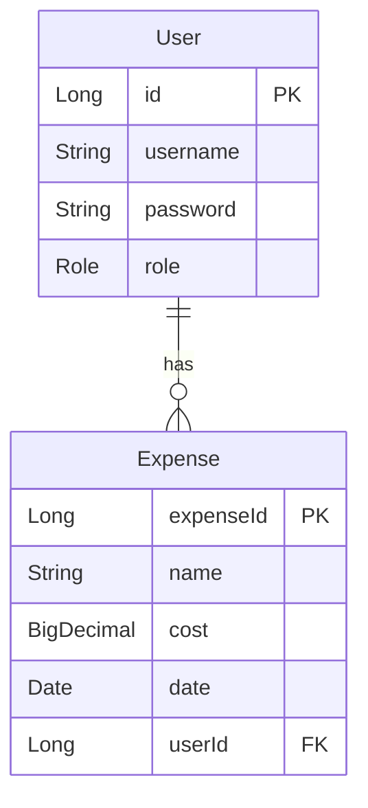

# Finances API  

---

API to keep track of expenses.

## Usage

* ### Auth [ api/v1/auth ]
		
		POST /login - Log to the application
		
		POST /register - Register a new user
		
* ### User [ api/v1/users ]

		GET / - Get all users  

		GET /{userId} -  Get user by ID
		
		PUT /{userId} - Update user
		
		DELETE /{userId} - Delete user

* ### Expense [ api/v1/users/{userId}/expenses ]

		GET / - Get all expenses from a user
		
		POST / - Create expense for a user
		
		GET /{expenseId} -  Get an expense from a user
		
		PUT /{expenseId} - Update an expense from a user
		
		DELETE /{expenseId} - Delete expense from a user

## UML Diagram

